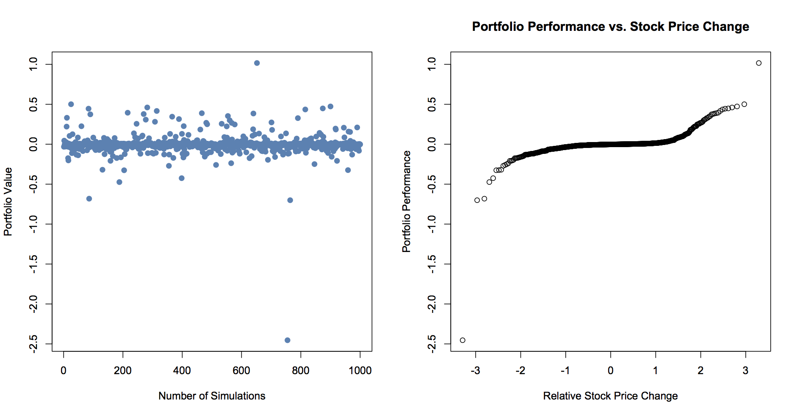

[](http://quantlet.de/)

## [](http://quantlet.de/) **SFEDeltaGammaSim** [](http://quantlet.de/)

```yaml

Name of Quantlet : SFEDeltaGammaSim

Published in : Statistics of Financial Markets I, SFM1

Description : Calculates performance of delta-gamma hedging for N simulated stock path trajectories

Keywords : 'delta-gamma, hedging, asset, performance, black-scholes, call, cost, strategy,
simulation'

See also : 'SFESLDHConv, SFEStopLossLogic, SFEDeltaHedgeGraph, SFEDeltaHedging,
SFEDeltahedgingLogic, SFEDeltahedgingdepend'

Author : Kristian Boroz, Awdesch Melzer

Submitted : 2016/12/11

Input: 
- S0: initial stock value
- sg: Volatility
- r: Risk free interest rate
- K1: Strike price call option 1
- K2: Strike price call option 2
- T1: time to maturity option 1
- T2: time to maturity option 2
- a: mean of stock process for simulation
- n: number of simulations (number of trajectories)
- n: number of realisations within stock trajectory

Output : (1) plot of portfolio value, (2) plot of performance relative to stock price change

```




### R Code:
```r
rm(list=ls(all=T))
graphics.off()

K1 = 100 # strike 1
K2 = 100 # strike 2
T1 = 1   # time to maturity
T2 = 1.1 # time to maturity
a = 0.02 # mean of stock process for simulation
sg = 0.2 # vola
N = 1000 # number of simulations
n = 100  # number of realisations of stock
S0 = 100 # initial stock price
r = 0.05 # interest rate

GammaCall = function(S,K,r, sigma,T,t){
	d1 = (log(S/K)+(r+sigma^2/2)*(T-t))/(sigma*sqrt(T-t))
    gamma  = dnorm(d1)/(S*sigma*sqrt(T-t))
	return(gamma)
}

DeltaCall = function(S,K,r, sigma,T,t){
  d1    = (log(S/K)+(r+sigma^2/2)*(T-t))/(sigma*sqrt(T-t));
  delta = pnorm(d1)
  return(delta)
}

BSCallPrice = function(S,K,r,sigma,T,t){
	d1    = (log(S/K)+(r+sigma^2/2)*(T-t))/(sigma*sqrt(T-t))
    d2    = d1-sigma*sqrt(T-t)
	price = S*pnorm(d1)-K*exp(-r*(T-t))*pnorm(d2)
}
simulategbm = function(mu,sigma,s,T,n){
	t  = c(0:n)/n
	bm = cumsum(sqrt(T/n)*c(0, rnorm(n)))
	y  = s*exp((mu-sigma^2/2)*T*t +sigma*bm)
	return(list(tmp=t,y=y))
}

gammahedge = function(K1,K2,T1,T2,a,sg,N,n,S0,r){
# Returns the error in the gamma hedge
dt = T1/n
# Initiate the portfolio using V-C = 0
# Number of shares of the derivative:
h2 = GammaCall(S0,K1,r,sg,T1,0)/GammaCall(S0,K2,r,sg,T2,0)
# Number of shares of stock:
h1 = DeltaCall(S0,K1,r,sg,T1,0)-h2*DeltaCall(S0,K2,r,sg,T2,0)
# Dollars in the MMA:
h0 = BSCallPrice(S0,K1,r,sg,T1,0)-h1*S0-h2*BSCallPrice(S0,K2,r,sg,T2,0);
# Initiate the error
P = c()

for (i in 1:N){ # Simulate N price processes
    # The price process:
    all = simulategbm(a,sg,S0,T1,n)
    S   = all$y
    tmp = all$tmp
# The price process for the derivative Y:
Y = c()
for (j in seq(0,T1,by=dt)){
    index = round(j/dt+1)
    Y     = c(Y, BSCallPrice(S[index],K2,r,sg,T2,j))
}

B = exp(r*tmp);
# For each price process, simulate the hedging portfolio
for (t in seq(dt,T1-dt,by=dt)){
    step = round(t/dt+1)
    # Refinance the portfolio:
    h2_tmp = GammaCall(S[step],K1,r,sg,T1,t)/GammaCall(S[step],K2,r,sg,T2,t)
    h2     = c(h2, h2_tmp)
    h1_tmp = DeltaCall(S[step],K1,r,sg,T1,t)-h2_tmp*DeltaCall(S[step], K2,r,sg,T2,t);
    h1     = c(h1, h1_tmp)
    h0_tmp = (h0[length(h0)]*B[step] + (h1[length(h1)-1]-h1[length(h1)])*S[step] +
        (h2[length(h2)-1] - h2[length(h2)])*Y[step] )/B[step]
    h0 = c(h0, h0_tmp)
    # C_tmp = BScallprice(S(end),K,r,sg,T,t)
}
P_tmp = h0[length(h0)]*B[length(B)] + h1[length(h1)]*S[length(S)] + h2[length(h2)]*BSCallPrice(S[length(S)],K2,r,sg,T2,T1) - max(S[length(S)]-K1,0)
P = c(P, P_tmp)
# Re-initiate the portfolio for the next price process:
h2 = h2[1]
h1 = h1[1]
h0 = h0[1]
}
return(P)
}
# portfolio value
P = gammahedge(K1,K2,T1,T2,a,sg,N,n,S0,r)
par(mfrow=c(1,1))
plot(P,xlab="Number of Simulations",ylab="Portfolio Value",pch=16,cex=1.2,col="steelblue",lwd=2)
#boxplot(P, horizontal=T)
qqnorm(P,main = 'Portfolio Performance vs. Stock Price Change', xlab = 'Relative Stock Price Change', ylab = 'Portfolio Performance')

```
