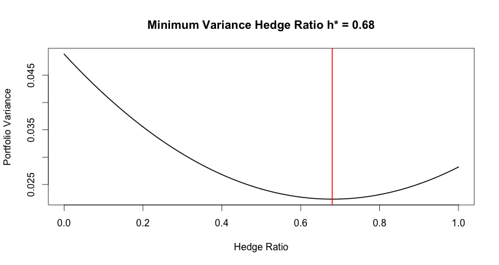

[](http://quantlet.de/)

## [](http://quantlet.de/) **SFEHedgeRatio** [](http://quantlet.de/)

```yaml

Name of Quantlet : SFEHedgeRatio

Published in : Statistics of Financial Markets I

Description : 'Computes and plots the optimal hedge ratio for a given dataset. The hedge ratio is
optimal under the assumption of gaussian distributed returns. The optimal hedge ratio minimized the
variance of the hedge portfolio. The example uses daily data from DAX and FDAX (11/2014 -
11/2016).'

Keywords : financial, risk, distribution, variance, optimization, dax, derivative

Author : Sophie Burgard, Anna Kubik

Datafile : DAX_FDAX.csv

See also : SFEHedgeRatioDCC

```




### R Code:
```r
#set working directory
setwd("...")

#read data set
data = read.csv2("DAX_FDAX.csv", stringsAsFactors = F)

# import closing prices
stock  = as.numeric(data[250:500,2])
future = as.numeric(data[250:500,3])

#generate log-returns
r_s = diff(log(stock))
r_f = diff(log(future))


# function for calculating the optimal hedge ratio
hedgeratio = function(s,f){
    fmin = function(h){
        var(s - h*f)}
    opt = nlm(fmin, 0.5)
    return(opt$estimate)
}

h_opt = hedgeratio(r_s, r_f)
paste("The optimal hedge ratio is: ", round(h_opt,6))

#Plot:
#calculating yearly variance:
fmin2 = function(h){
  var(r_s - h*r_f)*250}

x = seq(0,1,0.001)
y = lapply(x, fmin2)

plot(x,y, type= "l", lwd = "2",
     ylab = "Portfolio Variance",
     xlab = "Hedge Ratio",
     main = paste("Minimum Variance Hedge Ratio h* = ", round(h_opt,4), sep=""))
abline(v = h_opt, lwd = "2", col = "red") #vertical line at h_opt


```
