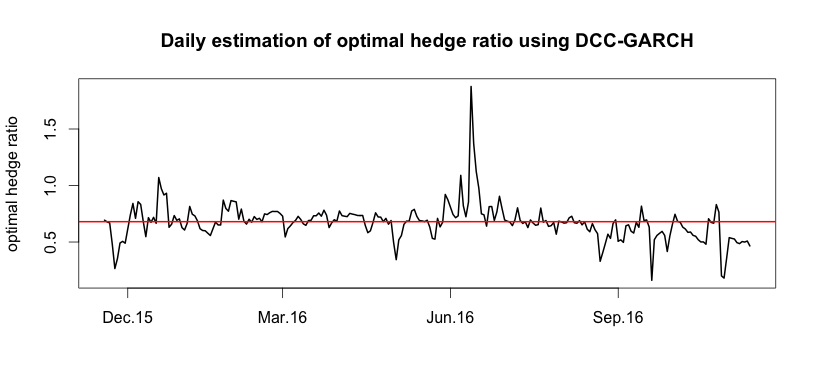

[](http://quantlet.de/)

## [](http://quantlet.de/) **SFEHedgeRatioDCC** [](http://quantlet.de/)

```yaml

Name of Quantlet : SFEHedgeRatioDCC

Published in : Statistics of Financial Markets I

Description : 'Computes and plots the optimal hedge ratio for a given dataset. The optimal hedge
ratio minimized the variance of the hedge portfolio. A Dynamic conditional correlation (DCC) GARCH
model is estimated. Using a rolling window approach, forecasts for the hedge ratio (as the ratio of
conditional covariance and conditional variance of the future) are made daily. The example uses
daily data from DAX and FDAX (11/2014 - 11/2016).'

Keywords : financial, risk, distribution, variance, optimization, dax, derivative, garch

Author : Sophie Burgard, Anna Kubik

Datafile : DAX_FDAX.csv

See also : SFEHedgeRatio

```




### R Code:
```r
#set working directory
setwd("...")

#install necessary packages if needed
libraries = c("rmgarch")
lapply(libraries, function(x) if (!(x %in% installed.packages())) {
  install.packages(x)
})
lapply(libraries, library, quietly = TRUE, character.only = TRUE)

#load data
data = read.csv2("DAX_FDAX.csv", stringsAsFactors = F)

# import closing prices 
stock  = as.numeric(data[,2])
future = as.numeric(data[,3])

#generate log-returns
r_s     = diff(log(stock))
r_f     = diff(log(future))
returns = data.frame(cbind(r_s, r_f))


###GARCH estimation
#specify model of univariate GARCH
xspec = ugarchspec(mean.model = list(armaOrder = c(0, 0)),
                   variance.model = list(garchOrder = c(1,1), model = 'sGARCH'),
                   distribution.model = 'norm')

#repeat univarate model to both time series
uspec = multispec(replicate(2, xspec))

#specify distribution of multivariate GARCH
spec1 = dccspec(uspec = uspec, dccOrder = c(1, 1), distribution = 'mvnorm')

#specify window size (1 year) for rolling window
w = 250

#determine step size, (daily for one year):
steps = seq(0,250,1)

#rolling window estimation:
for (i in 1:length(steps)){
    s  = returns[c(steps[i]):c(w+steps[i]), 1]
    f  = returns[c(steps[i]):c(w+steps[i]), 2]
    RW = cbind(s,f)
    
    #fit multivariate model
    multf = multifit(uspec, RW)
    fit   = dccfit(spec1, data = RW, fit.control = list(eval.se = TRUE), fit = multf)

    #one-step ahead forecast
    fc1 = dccforecast(fit, n.ahead = 1)
    H_t = matrix(unlist(fc1@ mforecast$H), nrow = 2)
  
    #store results in matrix
    if (i == 1){
        H_collect = matrix(rep(0,4), nrow = 2)
        H_collect = H_t     
        hedge_ratio = H_t[1,2]/H_t[2,2]
    }else{
       H_collect = rbind(H_collect, H_t)
       HR = H_t[1,2]/H_t[2,2]
       hedge_ratio = rbind(hedge_ratio, HR)
    } 
}


#### PLOT
plot(hedge_ratio, type = "l", lwd = 2,
     axes  = F,
     frame = TRUE,
     ylab  = "optimal hedge ratio",
     xlab  = " ",
     main  = "Daily estimation of optimal hedge ratio using DCC-GARCH")

#determine axes ticks and positions
time.labels = format(as.Date(data[,1], '%d.%m.%y'), '%b.%y')
ind1        = seq(250, 500, 5)
time.tick   = time.labels[ind1]
ind2        = c(2, 14, 27, 40 )
time.tick   = time.tick[ind2]

axis(side = 1, at = ind2*5, label = time.tick)
axis(side = 2, ylim = c(0.2, 1))

#add line for constant hedge ratio from OLS
abline(h = 0.68, col = "red", lwd = "2")


```
