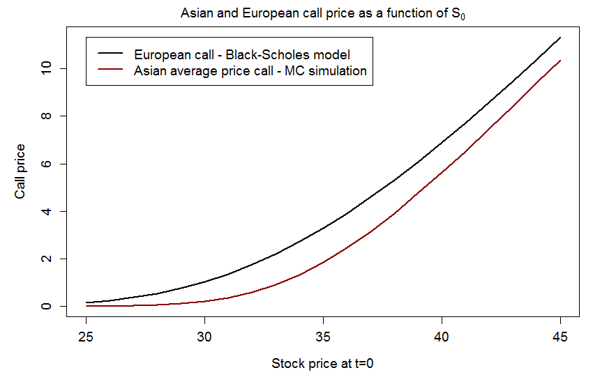

[](http://quantlet.de/)

## [](http://quantlet.de/) **SFEMCAsianCallVsEuropCall** [](http://quantlet.de/)

```yaml


Name of Quantlet: SFEMCAsianCallVsEuropCall

Published in:     Statistics of Financial Markets I

Description:     'Plots option price as a function of current stock price for 
                  Asian call and European call. Asian call price is calculated
                  using Monte-Carlo Simulation, the European call price is 
                  calculated using the Black-Scholes model.'
              
Keywords:        'exotic-option, european-option, option-price, monte-carlo, 
                  simulation, option, call, put, black-scholes, stock-price'

Author:           Stefan Ritschel

See also:         SFEAsianCallPayoff, SFEMCAsian, SFEMCEurop, SFEMCEuropConv

Submitted:        2016/12/16


Input: 
- s0min:  min current stock price
- s0max:  max current stock price
- s0step: stepsize for s0    
- k:      strike price
- tau:    time to maturity in years
- n.t:    number of time steps
- r:      annual interest rate
- sigma:  volatility
- n.mc:   number MC samples

Output:   Plot of call prices as function of current stock price.


```



### R Code
```r

# clear variables and close windows
rm(list = ls(all = TRUE))
graphics.off()

# settings
s0min  = 25    # range for current stock price    
s0max  = 45
s0step = 1    
    
k      = 35    # strike price
tau    = 1     # time to maturity in years
n.t    = 252   # number of time steps (used for stock simulation and averaging)
r      = 0.03  # annual interest rate
sigma  = 0.2   # volatility
n.mc   = 10^4  # number MC samples

# function for simulating stock price by geometric brownian motion
MCPath = function(s0, tau, n.t, r, sigma) {
    dt = tau/n.t
    t  = seq(0, tau, by = dt)
    st = s0 * exp((r - sigma^2/2) * t + sigma * sqrt(dt) * c(0, cumsum(rnorm(n.t))))
    return(st)
}

# function for calculating MC estimate of asian call price
MCAsian = function(s0, k, tau, n.t, r, sigma, n.mc) {
    v.sum = 0
    for (i in 1:n.mc) {
        st    = MCPath(s0, tau, n.t, r, sigma)
        s.avg = sum(st)/length(st)                  # arithmetic average
        v     = exp(-r * tau) * pmax(0, s.avg - k)  # discounted payoff (average price)
        v.sum = v.sum + v                           # sum for MC estimate
    }
    v.mc = v.sum/n.mc  # MC estimate
    return(v.mc)
}

# function for calculating the Black-Scholes price of European call
BSEuropCall = function(s0, k, tau, r, sigma) {
    d1 = (log(s0/k) + (r + (sigma^2/2)) * tau)/(sigma * sqrt(tau))
    d2 = d1 - (sigma * sqrt(tau))
    c  = s0 * pnorm(d1) - k * exp(-r * tau) * pnorm(d2)
    return(c)
}

# main

s0        = seq(s0min, s0max, by = s0step)
AsianCall = rep(0, length(s0))
EuropCall = rep(0, length(s0))

# calculate European and Asian call prices for several stock prices s0
for (i in 1:length(s0)) {
    AsianCall[i] = MCAsian(s0[i], k, tau, n.t, r, sigma, n.mc)
    EuropCall[i] = BSEuropCall(s0[i], k, tau, r, sigma)
    cat("\rprogress: ", round(i/length(s0)*100),"%")  # progress information
}

#pdf("AsianVsEuropCall.pdf", width = 8, height = 5)
par(mar = c(5, 5, 2, 1))
plot(s0, AsianCall, type = "l", lwd = 2, col = "darkred", 
     main = expression("Asian and European call price as a function of " * "S"["0"]),
     ylim = c(min(AsianCall, EuropCall), max(AsianCall, EuropCall)), 
     xlab = "Stock price at t=0", ylab = "Call price", 
     cex.lab = 1.2, cex.axis = 1.2, cex.main = 1.2, cex.sub = 1.2)
lines(s0, EuropCall, type = "l", lwd = 2, lty = 1, col = "black")
legend(min(s0), max(EuropCall), lwd = 2, lty = c(1, 1), cex = 1.2, col = c("black", "darkred"),
       legend = c("European call - Black-Scholes model ", "Asian average price call - MC simulation"))
#dev.off()


```

automatically created on 2018-05-28