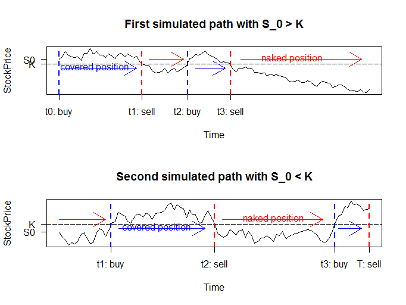

[](http://quantlet.de/)

## [](http://quantlet.de/) **SFEStopLossThGraph** [](http://quantlet.de/)

```yaml

Name of Quantlet : SFEStopLossThGraph

Published in : Statistics of Financial Markets I

Description : 'Generates and plots the path of two stocks and marks the theoretical buying and
selling time points in continuous time of a stop-loss hedging strategy'

Keywords : 'stop-loss, hedging, continuous, asset, black-scholes, call, simulation, cost, delta,
strategy'

See also : SFEStopLossLogic, SFESLDHPerf, SFESLDHConv, SFEDeltaHedgeGraph, SFSstoploss

Author : Simon Gstöhl, Florian Schulz

Submitted : 2016/12/05

Input: 
- S0_1: Stock price at t = 0 for first path
- S0_2: Stock price at t = 0 for second path
- sig: Volatility
- r: Risk free interest rate
- K: Strike price
- t0: Starting time (1 week = 1/52)
- mat: Maturity
- dt: Time period between steps.

Output : 'A plot of two simulated stocks with theoretical buy and sell times in comtinuous time
within the stop-loss hedging strategy.'

```




### R Code:
```r
# clear variables and close windows
rm(list = ls(all = TRUE))
graphics.off()

# Declare stock price variables
S0_1  = 51                      # current stock price
S0_2  = 49                      # current stock price
sig   = 0.2                     # volatility 

# Declare option pricing variables
r     = 0.05                    # interest rate
K     = 50                      # strike price
t0    = 0/52                    # current time (1 week = 1/52)
mat   = 20/52                   # maturity

# Parameters for calculations
dt    = 0.2/52                  # period between steps
np    = (mat - t0)/dt           # number of periods
t     = seq(t0, mat, dt)        # maturity - t0 divided in n intervals
tau   = mat - t                 # times to maturity

# Simulate first stock price path
set.seed(18)                    # in order to make the simulation replicable
Wt  = c(0, cumsum(sqrt(dt) * rnorm(np)))
S   = S0_1 * exp((r - 0.5 * sig^2) * t + sig * Wt)

# Calculate buying and selling timepoints
Buy       = (S[1:np] < K) * (S[2:(np + 1)] > K)
Sell      = (S[1:np] > K) * (S[2:(np + 1)] < K)
buytime   = numeric(sum(Buy))   # predefined zero vector for efficiency
selltime  = numeric(sum(Sell))  # length of buy/sell time is the number of purchases/sales

# Define counting variables for calculations
n = 1
m = 1

for (k in 1:length(Buy)) {
    if (Buy[k] == 1) {
        buytime[n]  = t[k + 1]
        n           = n + 1
    }
    if (Sell[k] == 1) {
        selltime[m] = t[k + 1]
        m           = m + 1
    }
}

#Make specific specifications for plotting
corrbuyt  = c(0, buytime[1] - 0.12/52)  
buyaxis   = c("t0: buy", "t2: buy")
corrsellt = selltime - c(0.06/52, 0.15/52)
sellaxis  = c("t1: sell", "t3: sell")

# Plot
par(mfrow = c(2, 1))
plot(t, S, type = "l", lwd = 1.5, ylab = "StockPrice", xlab = "Time", xaxt = "n", yaxt = "n", main = "First simulated path with S_0 > K")
abline(h = 50, lty = 5)
axis(2, K, "K", las = 1)
axis(2, S0_1, "S0", las = 1)
axis(1, corrbuyt, buyaxis)
axis(1, corrsellt, sellaxis)
abline(v = corrbuyt, lty = 2, lwd = 2, col = "blue")
abline(v = corrsellt, lty = 2, lwd = 2, col = "red")
arrows(0.2/52, 49, 5/52, 49, col = "blue")
text(2.3/52, 49.3, "covered position", col = "blue")
arrows(5.8/52, 51, 8/52, 51, col = "red")
arrows(8.8/52, 49, 10.7/52, 49, col = "blue")
arrows(11.7/52, 51, 19.5/52, 51, col = "red")
text(15/52, 51.3, "naked position", col = "red")

# Simulate second stock price path
set.seed(288)                   # in order to make the simulation replicable
Wt  = c(0, cumsum(sqrt(dt) * rnorm(np)))
S   = S0_2 * exp((r - 0.5 * sig^2) * t + sig * Wt)

# Calculate buying and selling timepoints
Buy       = (S[1:np] < K) * (S[2:(np + 1)] > K)
Sell      = (S[1:np] > K) * (S[2:(np + 1)] < K)
buytime   = numeric(sum(Buy))   # predefined zero vector for efficiency
selltime  = numeric(sum(Sell))  # length of buy/sell time is the number of purchases/sales

# Define counting variables for calculations
n = 1
m = 1

for (k in 1:length(Buy)) {
    if (Buy[k] == 1) {
        buytime[n]  = t[k + 1]
        n           = n + 1
    }
    if (Sell[k] == 1) {
        selltime[m] = t[k + 1]
        m           = m + 1
    }
}

#Make specific specifications for plotting
corrbuyt  = buytime - c(0.05/52, 0.035/52)  
buyaxis   = c("t1: buy", "t3: buy")
corrsellt = c(selltime[1] - 0.17/52, mat)
sellaxis  = c("t2: sell", "T: sell")

# Plot
plot(t, S, type = "l", lwd = 1.5, ylab = "StockPrice", xlab = "Time", xaxt = "n", yaxt = "n", main = "Second simulated path with S_0 < K")
abline(h = 50, lty = 5)
axis(2, K, "K", las = 1)
axis(2, S0_2, "S0", las = 1)
axis(1, corrbuyt, buyaxis)
axis(1, corrsellt, sellaxis)
abline(v = corrbuyt, lty = 2, lwd = 2, col = "blue")
abline(v = corrsellt, lty = 2, lwd = 2, col = "red")
arrows(0, 50.6, 3/52, 50.6, col = "red")
arrows(3.85/52, 49.4, 9.4/52, 49.4, col = "blue")
text(6.3/52, 49.58, "covered position", col = "blue")
arrows(10.5/52, 50.6, 17/52, 50.6, col = "red")
text(13.8/52, 50.78, "naked position", col = "red")
arrows(18/52, 49.4, 19.5/52, 49.4, col = "blue")

#END

```
