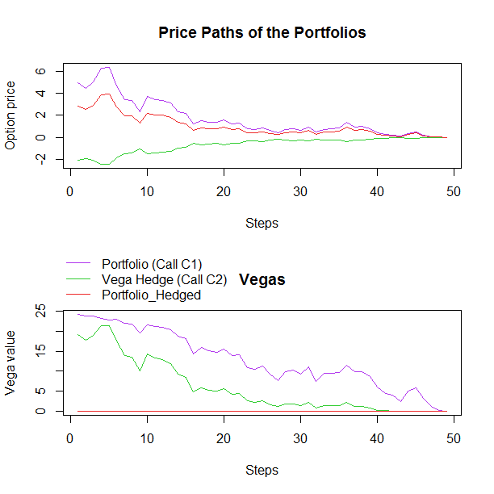
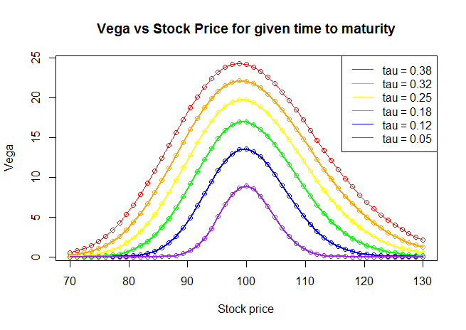

[](http://quantlet.de/)

## [](http://quantlet.de/) **SFEVegaHedging** [](http://quantlet.de/)

```yaml

Name of Quantlet : SFEVegaHedging

Published in : Statistics of Financial Markets I

Description : Constructing a vega-neutral portfolio

Keywords : vega, hedging, neutral portfolio, simulation, hedging cost

Author : Victor Cluzel, Florian Reichert

Submitted : Wed, November 30 2016

Output : Graphs of hedging costs and vega dependency on stock price and time to maturity

```






### R Code:
```r
rm(list = ls(all = TRUE))
graphics.off()

# Declare variables
n   = 50        # periods (steps)
S0  = 98        # initial stock price
sig = 0.2       # volatility
r   = 0.05      # risk-free interest rate
K1  = 100       # exercise price of call C1
K2  = 110       # exercise price of call C2
t0  = 6/52      # current time (1 week = 1/52)
mat = 26/52     # maturity

# Function for price of the call
black_scholes_call = function(S, K, Tau, r, sigma) {
                 y = (log(S/K) + (r - sigma^2/2) * Tau)/(sigma * sqrt(Tau))
                 v = S * pnorm(y + sigma * sqrt(Tau)) - exp(-r * Tau) * K * pnorm(y)
                 return(v)
}

# Function for vega
black_scholes_vega = function(S, K, Tau, r, sigma) {
                 y = (log(S/K) + (r - sigma^2/2) * Tau)/(sigma * sqrt(Tau))
                 v = S * sqrt(Tau) * dnorm(y + sigma * sqrt(Tau))
                 return(v)
}


GeneratePaths = function(S0, sig, maturity, K1, K2, r, n, t0) {
          dt 	= (maturity - t0)/n             # period between steps n 
          t 	= seq(t0, maturity, l = n)      # maturity - t0 divided in n intervals
          tau = maturity - t                  # time to maturity
  
  # Simulate the stock price path
  Wt 	= c(0, sqrt(dt) * cumsum(rnorm(n - 1, 0, 1)))
  S 	= S0 * exp((r - 0.5 * sig^2) * t + sig * Wt)
  
  # Compute vegas and the associated hedging costs
  C1              = black_scholes_call(S, K1, tau, r, sig)
  C2              = black_scholes_call(S, K2, tau, r, sig)
  vega1           = black_scholes_vega(S, K1, tau, r, sig)
  vega2           = black_scholes_vega(S, K2, tau, r, sig)
  hedge_costs     = c(-vega1[1]/vega2[1] * C2[1], -(vega1[2:n]/vega2[2:n]) * C2[2:(n)])
  ptf_hedged      = C1 + hedge_costs
  vega3           = vega1 + (hedge_costs / C2) * vega2
  
  # Result
  result = data.frame(C1 = C1[1:(n-1)], CumCosts = hedge_costs[1:(n-1)], ptf_hedged = ptf_hedged[1:(n-1)],
                      vega1 = vega1[1:(n-1)],vega2 = vega2[1:(n-1)],vega3 = vega3[1:(n-1)])
                      return(result)
}

# Run simulation of the result
sim = GeneratePaths(S0 = S0, sig = sig, maturity = mat, K1 = K1, K2 = K2, r = r, n = n, 
                    t0 = t0)


# Plot vega vs sigma for different time to maturities
# parameter settings
Smin   = 70         # lower bound of stock price
Smax   = 130        # upper bound of stock price
taumin = 0.05       # lower bound of time to maturity
taumax = 20/52      # upper bound of time to maturity
S0     = 98         # initial stock price
K      = 100        # strike price
r      = 0.05       # interest rate
sigma  = 0.2        # volatility
steps  = 50
tsteps = 5
T      = 26/52
St     = seq(Smax, Smin, by = -(Smax - Smin)/(steps))
taus   = seq(taumax, taumin, by = -(taumax - taumin)/tsteps)  # different time to maturity
vega   = matrix(0, (steps + 1), length(taus))


# Calculation of vega for the different Stock price at constant time to maturity
for (i in 1:length(taus)) {
  vega[, i] = black_scholes_vega(St, K, taus[i], r, sigma)
}
plot(St, vega[, 1], col = "red", xlab = "Stock price", ylab = "Vega", main = "Vega vs Stock Price for given time to maturity")
lines(St, vega[, 1], col = "red")

points(St, vega[, 2], col = "orange")
points(St, vega[, 3], col = "yellow")
points(St, vega[, 4], col = "green")
points(St, vega[, 5], col = "blue")
points(St, vega[, 6], col = "purple")

lines(St, vega[, 2], col = "orange", lwd = 2)
lines(St, vega[, 3], col = "yellow", lwd = 2)
lines(St, vega[, 4], col = "green", lwd = 2)
lines(St, vega[, 5], col = "blue", lwd = 2)
lines(St, vega[, 6], col = "purple", lwd = 2)

legend("topright", c(paste("tau =", round(taus[1:6], digits = 2))), col = c("red","orange","yellow","green","blue", 
                                                                            "purple" ), lty = 1) 

# Prepare second screen
dev.new()
split.screen(c(2, 1))

# Plot the Option prices
screen(1)
plot(x = 1:nrow(sim), y = sim[, 1], main = "Price Paths of the Portfolios", xlab = "Steps", ylab = "Option price", 
     ylim = c(min(sim[, 1], sim[, 2], sim[, 3]), max(sim[, 1], sim[, 2], sim[, 3])), 
     type = "l", col = "darkorchid2")
lines(x = 1:nrow(sim), y = sim[, 2], col = "limegreen")
lines(x = 1:nrow(sim), y = sim[, 3], col = "firebrick2")

# Plot the vegas
screen(2)
plot(x = 1:nrow(sim), y = sim[, 4], main = "Vegas", xlab = "Steps", ylab = "Vega value", 
     ylim = c(min(sim[, 4], sim[, 5], sim[, 6]), max(sim[, 4], sim[, 5], sim[, 6])), 
     type = "l", col = "darkorchid2")
lines(x = 1:nrow(sim), y = sim[, 5], col = "limegreen")
lines(x = 1:nrow(sim), y = sim[, 6], col = "firebrick2")
par(xpd=TRUE)
legend(x=-2, y = 41, legend=c("Portfolio (Call C1)", "Vega Hedge (Call C2)", "Portfolio_Hedged"),
       lty=1, lwd=1, col=c("darkorchid2", "limegreen", "firebrick2"),bty = "n")


```
